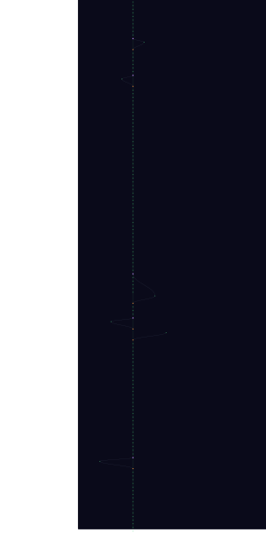

# copt

<!-- Project Shields/Badges -->
<p align="center">
  <a href="https://github.com/XAOSTECH/copt">
    
  </a>
  <a href="https://github.com/XAOSTECH/copt/releases">
    
  </a>
  <a href="https://github.com/XAOSTECH/copt/blob/main/LICENSE">
    
  </a>
</p>

<p align="center">
  <a href="https://github.com/XAOSTECH/copt/actions">
    
  </a>
  <a href="https://github.com/XAOSTECH/copt/issues">
    
  </a>
  <a href="https://github.com/XAOSTECH/copt/pulls">
    
  </a>
  <a href="https://github.com/XAOSTECH/copt/stargazers">
    
  </a>
  <a href="https://github.com/XAOSTECH/copt/network/members">
    
  </a>
</p>

<p align="center">
  
  
  
  
</p>

<!-- Optional: Stability/Maturity Badge -->
<p align="center">
  
  
</p>

---

<p align="center">
  <b>Capture Operations</b>
</p>

---

## 📋 Table of Contents

- [Overview](#-overview)
- [Features](#-features)
- [Installation](#-installation)
- [Usage](#-usage)
- [Configuration](#-configuration)
- [Documentation](#-documentation)
- [Contributing](#-contributing)
- [Roadmap](#-roadmap)
- [Support](#-support)
- [Licence](#-licence)
- [Acknowledgements](#-acknowledgements)

---

## 🔍 Overview

Low-level Wayland screen capture tool for UNIX systems. Uses FFmpeg's KMS grab to capture the framebuffer directly, with hardware-accelerated encoding via VAAPI or NVENC, plus ALSA audio capture.

### Why copt?

Wayland compositors don't expose the X11 screen-grab APIs that traditional tools rely on. `copt` uses the kernel's KMS (Kernel Mode Setting) framebuffer interface through FFmpeg's `kmsgrab` device, giving you zero-copy GPU capture with hardware encoding — no Xwayland needed.

### Monorepo Note (video-tools)

When `copt` is used inside the [`video-tools`](https://github.com/XAOSTECH/video-tools) monorepo, use the shared OBS crash-recovery launcher from [`../op-cap/scripts/obs-safe-launch.sh`](https://github.com/XAOSTECH/op-cap/blob/main/scripts/obs-safe-launch.sh).

---

## ✨ Features

- **KMS Grab** — Capture the Wayland framebuffer via `/dev/dri` without compositor cooperation
- **Hardware Encoding** — VAAPI (Intel/AMD) and NVENC (NVIDIA) with automatic detection
- **Software Fallback** — Falls back to libx264/libx265 when no hardware encoder is available
- **ALSA Audio** — Captures system audio via ALSA with auto-detection of devices
- **Region Crop** — Capture a specific region of the screen with configurable X/Y/W/H
- **Resolution Scaling** — Scale down from native resolution to any output size
- **Config File** — Persistent settings in `~/.config/copt/copt.conf`
- **Dry Run** — Preview the FFmpeg command without executing
- **System Probe** — Detect GPUs, DRI devices, audio hardware, and available encoders

---

## 📥 Installation

### Prerequisites

- Linux with KMS support (kernel 5.x+)
- FFmpeg built with `--enable-libx264` and kmsgrab support
- GPU drivers (Mesa for VAAPI, or NVIDIA proprietary for NVENC)
- Root/sudo access (required for KMS framebuffer reads)

### Quick Start

```bash
# Clone the repository
git clone https://github.com/XAOSTECH/copt.git
cd copt

# Install to /usr/local/bin
./install.sh

# Or just run directly
chmod +x copt
sudo ./copt --help
```

### Manual Install

```bash
sudo install -Dm755 copt /usr/local/bin/copt
mkdir -p ~/.config/copt
cp copt.conf.example ~/.config/copt/copt.conf
```

---

## 🚀 Usage

### Basic Usage

```bash
# Full screen capture with auto-detection of GPU, encoder, and audio
sudo copt -o ~/recording.mkv
```

### Advanced Usage

```bash
# Capture a 1920x1080 region from offset (100,200), encode with NVENC, no audio
sudo copt --crop-x 100 --crop-y 200 --crop-w 1920 --crop-h 1080 \
    -e nvenc -A -o /tmp/region.mkv
```

### Examples

<details>
<summary>📘 Example 1: Full Screen (3456x2160 → 1440x900)</summary>

```bash
sudo copt -W 3456 -H 2160 -w 1440 -h 900 \
    -d /dev/dri/card1 -a hw:0,6 -o ~/screen.mkv
```

</details>

<details>
<summary>📗 Example 2: 30fps clip, 60 second duration, software encoder</summary>

```bash
sudo copt -r 30 -t 60 -e x264 -q 23 -o /tmp/clip.mkv
```

</details>

<details>
<summary>📙 Example 3: Probe your system to find devices</summary>

```bash
sudo copt --probe
```

</details>

<details>
<summary>📕 Example 4: Dry run — see the ffmpeg command without executing</summary>

```bash
sudo copt --crop-w 1920 --crop-h 1080 --dry-run
```

</details>

---

## ⚙️ Configuration

### Environment Variables

All settings can be set via environment variables prefixed with `COPT_`:

| Variable | Description | Default |
|----------|-------------|---------|
| `COPT_DRI_DEVICE` | DRI card device path | auto-detect |
| `COPT_SCREEN_W` | Source screen width | `3456` |
| `COPT_SCREEN_H` | Source screen height | `2160` |
| `COPT_OUT_W` | Output video width | `1440` |
| `COPT_OUT_H` | Output video height | `900` |
| `COPT_CROP_X` | Crop region X offset | `0` |
| `COPT_CROP_Y` | Crop region Y offset | `0` |
| `COPT_CROP_W` | Crop region width | screen width |
| `COPT_CROP_H` | Crop region height | screen height |
| `COPT_ENCODER` | Encoder: auto/vaapi/nvenc/x264/x265 | `auto` |
| `COPT_QUALITY` | CRF/QP value (0-51) | `20` |
| `COPT_FRAMERATE` | Capture framerate | `60` |
| `COPT_AUDIO` | Enable audio (1/0) | `1` |
| `COPT_AUDIO_DEVICE` | ALSA device | auto-detect |
| `COPT_AUDIO_CODEC` | Audio codec: aac/opus/mp3/copy | `aac` |
| `COPT_OUTPUT` | Output file path | `/tmp/copt-output.mkv` |
| `COPT_DURATION` | Duration in seconds (0=unlimited) | `0` |

### Configuration File

```bash
# ~/.config/copt/copt.conf
COPT_DRI_DEVICE="/dev/dri/card1"
COPT_SCREEN_W=3456
COPT_SCREEN_H=2160
COPT_OUT_W=1440
COPT_OUT_H=900
COPT_ENCODER=vaapi
COPT_AUDIO_DEVICE="hw:0,6"
```

See `copt.conf.example` for all options with documentation.

---

## 📝 Notes

- **Root required**: kmsgrab reads the KMS framebuffer directly and needs root privileges.
- **Multi-GPU**: If `/dev/dri/card0` doesn't work, try `card1` (common on hybrid GPU laptops).
- **Audio devices**: Check `cat /proc/asound/cards` and `cat /proc/asound/devices` to find yours.
- **Mouse cursor**: kmsgrab does **not** capture the mouse cursor (kernel limitation).
- **Wayland only**: This uses KMS grab, not PipeWire or X11 screen capture.

---

## 🤝 Contributing

Contributions are welcome! Please read our [Contributing Guidelines](CONTRIBUTING.md) before submitting PRs.

1. Fork the repository
2. Create your feature branch (`git checkout -b feature/AmazingFeature`)
3. Commit your changes (`git commit -m 'Add some AmazingFeature'`)
4. Push to the branch (`git push origin feature/AmazingFeature`)
5. Open a Pull Request

See also: [Code of Conduct](CODE_OF_CONDUCT.md) | [Security Policy](SECURITY.md)

---

## 🗺️ Roadmap

- [x] KMS grab screen capture with VAAPI encoding
- [x] NVENC and software encoder fallback
- [x] ALSA audio capture with auto-detection
- [x] Configurable crop regions and output scaling
- [ ] PipeWire audio capture support
- [ ] Multi-monitor / specific output selection
- [ ] Overlay / mouse cursor compositing
- [ ] RTMP/SRT live streaming output

See the [open issues](https://github.com/XAOSTECH/copt/issues) for a full list of proposed features and known issues.

---

## 💬 Support

- 💻 **Issues**: [GitHub Issues](https://github.com/XAOSTECH/copt/issues)
- 💬 **Discussions**: [GitHub Discussions](https://github.com/XAOSTECH/copt/discussions)

---

## 📄 Licence

Distributed under the GPL-3.0 License. See [`LICENSE`](LICENSE) for more information.

---

## 🙏 Acknowledgements

- [FFmpeg](https://ffmpeg.org/) — the backbone of all encoding
- [KMS/DRM](https://www.kernel.org/doc/html/latest/gpu/drm-kms.html) — Linux kernel modesetting API
- [VAAPI](https://github.com/intel/libva) — Video Acceleration API
- [NVIDIA NVENC](https://developer.nvidia.com/nvidia-video-codec-sdk) — NVIDIA hardware video encoder

---

<p align="center">
  <a href="https://github.com/XAOSTECH">
    
  </a>
</p>

<p align="center">
  <a href="#copt">⬆️ Back to Top</a>
</p>
<!-- TREE-VIZ-START -->



[Full SVG](../.github/tree-viz/git-tree.svg) · [Interactive version](../.github/tree-viz/git-tree.html) · [View data](../.github/tree-viz/git-tree-data.json)

<!-- TREE-VIZ-END -->
